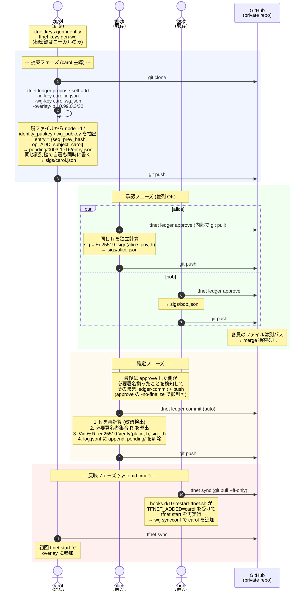
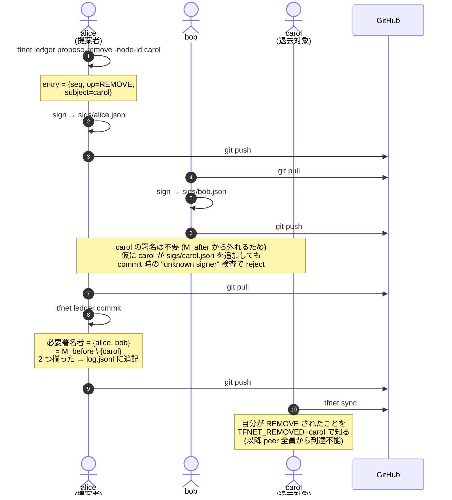
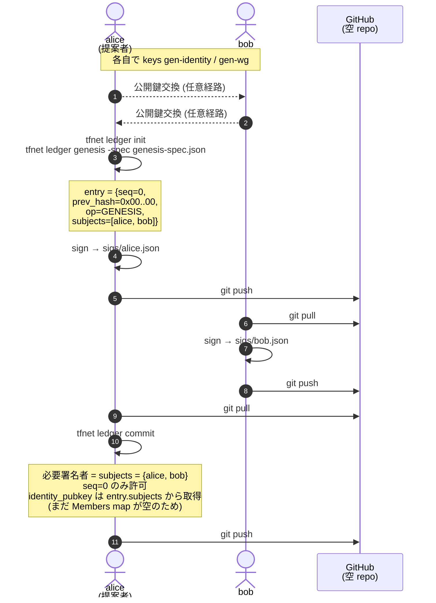
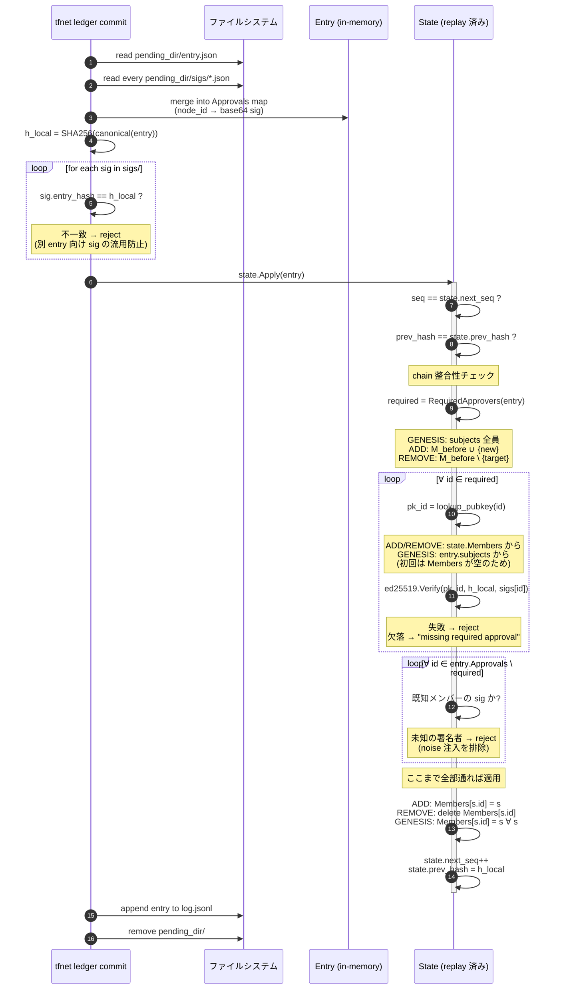

# 台帳署名のシーケンス図

[wg-evpn-l2vpn-design.md §3](./wg-evpn-l2vpn-design.md#3-メンバーシップ台帳認可レイヤー) で
規定されている N-of-N 署名フローを、本実装（GitHub を配信経路、`tfnet sync` で各ホスト
が定期的に pull する構成）に即した形で図解する。

凡例:

- `h = SHA256(canonical(entry))` — エントリのバイナリ canonical 形式の SHA-256
- `Ed25519_sign(priv, h)` — Ed25519 で `h` に署名
- `M_before` / `M_after` — そのエントリ適用前後のメンバー集合

---

## 1. メンバー追加 (ADD)

新メンバー carol を、既存メンバー alice / bob のいる台帳に加える例。
必要署名者 = `M_after = M_before ∪ {carol} = {alice, bob, carol}`（**新メンバーも自分の
参加に同意する署名が必要**）。

本実装では **新参 carol が自分の参加提案を自分で push する** フローを既定とする
（`tfnet ledger propose-self-add`）。公開鍵を既存メンバーに送って転記してもらう
ハンドオフが不要になり、`identity_pubkey` の取り違え事故も起こらない。代理提案
（`propose-add`）の経路も残してあるので、carol が push 権限を持たない場合は
既存メンバーが代行できる（下の補足を参照）。

> **代理提案ルート (`propose-add`) を取るとき**: carol に push 権限を渡さない／carol の手元に
> tfnet を入れたくない場合は、既存メンバーが `tfnet ledger propose-add -node-id ... -identity-pubkey ...
> -wg-pubkey ... -overlay-ip ...` で代行する。carol は別経路（`tfnet ledger sign -out` で出した
> detached 署名ファイル）を Slack 等で送り、提案者が `tfnet ledger merge` で取り込む。
> 安全性は同じ（commit 時に N-of-N の署名検証は同様に走る）。

---

## 2. メンバー削除 (REMOVE)

carol を退去させる例。必要署名者 = `M_before \ {carol} = {alice, bob}`（**退去対象自身
は署名しない**）。

---

## 3. Genesis (初期ブートストラップ)

`seq=0` の特別ケース。`M_before = {}` から始まり、必要署名者 = `subjects` 全員。
`prev_hash` は `0x00…00`。

---

## 4. commit 時の検証 (拡大図)

`tfnet ledger commit <pending_dir>` が内部で行う一連の検査。**一つでも失敗すれば
状態は一切変更されない**（all-or-nothing）。

---

## 補足: なぜ "sig.entry_hash == h_local" の検査が要るか

各 `sigs/<node>.json` は実は `entry_hash` フィールドを持っている。これは
entry.json が差し替えられた場合の **早期検出** 用。

攻撃シナリオ:

1. 攻撃者が `entry.json` を書き換えて push（subject.overlay_ip を別 IP に）
2. 古い sig は新しい h に対しては Ed25519.Verify が当然失敗する
3. しかしエラーメッセージが "invalid signature" になり、原因究明が遠回りになる

`sig.entry_hash` を先に比較すれば、即座に「sig は別のエントリ用」と特定できて
ログが読みやすい。**安全性は ed25519 検証だけで十分**（hash 比較は便宜上の
fail-fast に過ぎない）。
